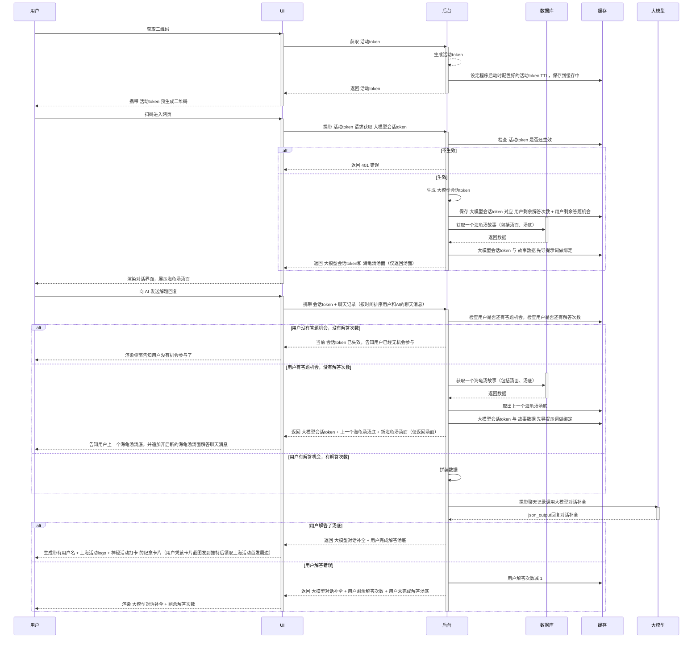

```mermaid
sequenceDiagram
    participant 用户
    participant UI
    participant 后台
    participant 数据库
    participant 缓存
    participant 大模型
    
    用户->>UI: 获取二维码
    activate UI
    UI->>后台: 获取 活动token
    activate 后台
    后台-->>后台: 生成活动token
    后台->>缓存: 设定程序启动时配置好的活动token TTL，保存到缓存中
    后台-->>UI: 返回 活动token
    deactivate 后台
    UI-->>用户: 携带 活动token 预生成二维码
    deactivate UI
    
    用户->>UI: 扫码进入网页
    activate UI
    UI->>后台: 携带 活动token 请求获取 大模型会话token
    activate 后台
    后台->>缓存: 检查 活动token 是否还生效
    alt 不生效
    	后台-->>UI: 返回 401 错误
    else 生效
    	后台->>后台: 生成 大模型会话token
    	后台->>缓存: 保存 大模型会话token 对应 用户剩余解答次数 + 用户剩余答题机会
    	activate 数据库
    	后台->>数据库: 获取一个海龟汤故事（包括汤面、汤底）
    	数据库-->>后台: 返回数据
    	deactivate 数据库
    	后台->>缓存: 大模型会话token 与 故事数据 先导提示词做绑定
    	后台-->>UI: 返回 大模型会话token和 海龟汤汤面（仅返回汤面）
    end
    deactivate 后台
    UI-->>用户: 渲染对话界面，展示海龟汤汤面
    deactivate UI
    
    用户->>UI: 向 AI 发送解题回复
    activate UI
    UI->>后台: 携带 会话token + 聊天记录（按时间排序用户和AI的聊天消息）
    activate 后台
    后台->>缓存: 检查用户是否还有答题机会，检查用户是否还有解答次数
    alt 用户没有答题机会，没有解答次数
    	后台-->>UI: 当前 会话token 已失效，告知用户已经无机会参与
    	UI-->>用户: 渲染弹窗告知用户没有机会参与了
    else 用户有答题机会，没有解答次数
    	activate 数据库
    	后台->>数据库: 获取一个海龟汤故事（包括汤面、汤底）
    	数据库-->>后台: 返回数据
    	deactivate 数据库
    	后台->>缓存: 取出上一个海龟汤汤底
    	后台->>缓存: 大模型会话token 与 故事数据 先导提示词做绑定
    	后台-->>UI: 返回 大模型会话token + 上一个海龟汤汤底 + 新海龟汤汤面（仅返回汤面）
    	UI-->>用户: 告知用户上一个海龟汤汤底，并追加开启新的海龟汤汤面解答聊天消息
    else 用户有解答机会，有解答次数
    	后台->>后台: 拼装数据
    end
    后台->>大模型: 携带聊天记录调用大模型对话补全
    activate 大模型
    大模型-->>后台: json_output回复对话补全
    deactivate 大模型
    alt 用户解答了汤底
    	后台-->>UI: 返回 大模型对话补全 + 用户完成解答汤底
    	UI-->>用户: 生成带有用户名 + 上海活动logo + 神秘活动打卡 的纪念卡片（用户凭该卡片截图发到推特后领取上海活动首发周边）
    else 用户解答错误
    	后台->>缓存: 用户解答次数减 1
      后台-->>UI: 返回 大模型对话补全 + 用户剩余解答次数 + 用户未完成解答汤底
      UI-->>用户: 渲染 大模型对话补全 + 剩余解答次数
    end
    deactivate 后台
    deactivate UI
    
```